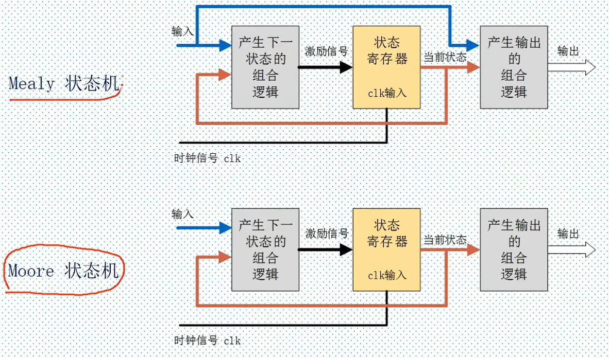

# ZYNQ
ZYNQ 7020=PS(Processiing System)(双核ARM Cortex A9 处理器)+PL(Programmable Logic)(FPGA)(Field Programmable Gate Array)的全可编程片上系统(APSoC)(All-Programmable System-on-Chip)

片上系统、板上系统（SoB）
ASIC（Application-Specific Integrated Circuit） 专用集成电路

## PL
1. 通用逻辑-CLB(Configurable Logic Block) 可配置逻辑块
-->2个Slice 片0、片1   
1个Slice-->4个LUTLook UP Table) 查找表  +8个FF (Flip-Flop) 触发器  
2. 专用算术运算-DSP(Digital Signal Processing Slice)数字信号处理切片
3. 专用逻辑存储-BRAM(Block RAM) 缓存

## PS
APU（Application Processing Unit，应用处理单元）
1. MMU(Memory Management Unit)
2. FPU（Floating-Point Unit，浮点运算单元）（与NEON融合）
3. NEON（Advanced SIMD Extension，高级单指令多数据扩展）(多媒体处理、数字信号处理)
4. SCU（Snoop Control Unit，窥探控制单元）缓存一致性管理
5. L1\L2 Cache 一级、二级缓存;L1I指令、L1D数据缓存

DDR（Double Data Rate SDRAM，双倍数据速率同步动态随机存储器）

## AXI 接口
AXI(Advanced Extensible Interface高级可扩展总线) is part of ARM's AMBA(Advanced Microcontroller Bus Architecture)   
M_xxx:Master  PS主机 PL从机   
S_xxx:Slave 反过来  
_GP0/1:GP(General-Purpose Ports)通用接口   
S_AXI_ACP:(Accelerator Coherency Port)加速器一致性端口 PL到cache快速访问   
S_AXI_HP0~3:(High Performance Ports)带有读/写FIFO的高性能端口，访问DDR

# verilog HDL语法
HDL：硬件编程语言  
## 符号 
**b,o,d,h 二、八、十、十六进制**  
4’b0101 表示4位二进制数字0101  
4’d2 表示4位十进制数字2（二进制0010）  
4’ha 表示4位十六进制数字a（二进制1010）  
16’b1001_1010_1010_1001 = 16’h9AA9   
前面不写默认32’d

注释和c语言一样

标识符定义模块、端口、信号名，字母、数字、$、_组合

数据类型：寄存器、线网、参数  
reg:默认初始为X,只能在always、initial里赋值  
如果该过程语句描述的是时序（组合）逻辑，即always语句（不）带有时钟信号，则reg对应为触发器（硬件连线）  
wire表示结构实体间的物理连线，值由驱动的元件决定，不能储存值   
parameter常量

（没说的运算都和c一样）  
`**`求幂，`%`求余运算结果取第一个操作数的符号  
逻辑运算结果有1,0，x(不确定)   
z是高阻态   
0,x,z都是假，1是真   
`===`case等于，`!==`case不等 把x、z当确定值比较，不会返回x，普通比较若有x返回结果都是x 

`~^`，`^~`按位同或  
若操作数位宽不同，小的自动补0  
左移时位宽增加，右移位宽不变 

{a,b} 拼接运算符，将ab拼接   

**缩减运算符**（单目运算，自己每一位算）符号同双目按位运算

**=阻塞赋值，<=非阻塞赋值（时序逻辑用）**  
阻塞：在一个always块中，后面的赋值语句是在前一句赋值语句结束后才开始赋值的  
非阻塞：赋值开始时，计算RHS(所有的右边表达式)；赋值结束时，更新LHS(算完一起更新)  

------
## 模块
模块结构：  
```
module 模块名([端口列表])
  [端口信号声明；]//输入输出属性 数据类型 位宽 名称
  [参数声明；]//parameter 数据类型 参数名=初值
  内部信号声明、assign语句、底层模块或门原语调用、always语句块
endmodule
```
模块名最好与文件名一致（尤其在Quartus II软件中调试时）  
端口列表写输入输出信号名称，逗号隔开  

输入输出属性有input output inout  
常用信号数据类型wire,reg ，不说默认wire  
信号位宽[n1:n2],不说默认1位

initial初始化语句，只执行一次，常用于测试文件的编写，用来产生仿真测试信号（激励信号）或对存储器变量赋初值

begin  end相当于花括号，顺序块语句(过程块)

**#+数字 表示延时**，后面再加一句#是往后加的时间

  
assign:（组合逻辑）连续赋值语句，只要表达式中操作数有变化，立刻计算和赋值，赋值目标必须是wire型的  
always:(组合/时序逻辑)块内顺序执行，块间并行  
   
always沿触发或电平触发  
括号内的叫敏感列表
```
//每过10ms时钟取反
always #10 sys_clk <= ~sys_clk;
//时序 posedge上升沿negedge下降沿
always @(posedge sys_clk or negedge sys_rst_n) begin
...
end
//
//组合
alway @(a or b or c) begin
out1=a?(b+c);
end
//*表示对后面(begin end里面用到的)所有输入变量的变化都是敏感的
always @(*)begin
...
end
```

一个always块内不要既用<=又用=  
多个always块不要对同一个变量赋值

条件语句必须在过程块（initial、always）中使用
```
if (...) begin
...
end

case (...)
   4'h0: ...;
   4'h1: ...;
   default: ...;
endcase
```
if else要配对以免产生latch(锁存器)（if不满足时变量保持原来的值，会用触发器加逻辑门模拟，浪费资源、引入毛刺）

case语句所有表达式位宽必须相等    
casez比较时不考虑高阻态 (有z的位忽略)  
casex不考虑x、z

模块调用  
例化实例元件
```
//f1
//顶层模块
module seg_led_static_top (
  input        sys_clk,
  input        sys_rst_n,
  output [5:0] sel,
  output [7:0] seg_led
);
parameter TIME_SHOW = 25'd25000_000;
wire addd_flag;
//main
time_count #(
  .MAX_NUM   (TIME_SHOW)
) u_time_count(
  .clk       (sys_clk),
  .rst_n     (sys_rst_n),
  .flag      (add_flag)
);
//f2
module time_count(
  input      clk,
  input      rst_n,
  output reg flag
);
parameter MAX_NUM = 50000_000;
reg [24:0] cnt;
```
------
## 状态机
状态机：在有限个状态之间按一定规律转换的时序电路  
有限状态机（FSM，Finite State Machine）
Mealy\Moore状态机
Mealy:输出与输入和当前状态有关
Moore:输出与当前状态有关

状态机四段论：
1.状态空间定义
2.状态跳转（时序逻辑）
3.下个状态判断（组合逻辑）
4.各个状态下的动作（组合逻辑）
最后可以再加一级寄存器，滤毛刺、时序计算方便、减少总线数据时间偏移