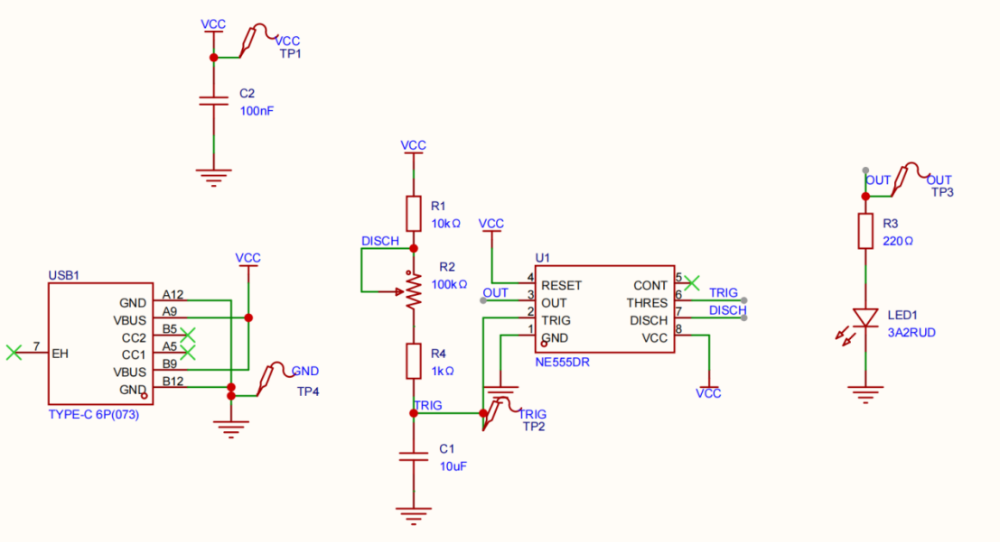
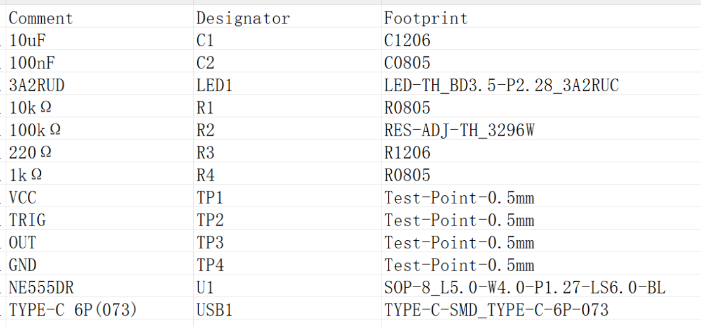
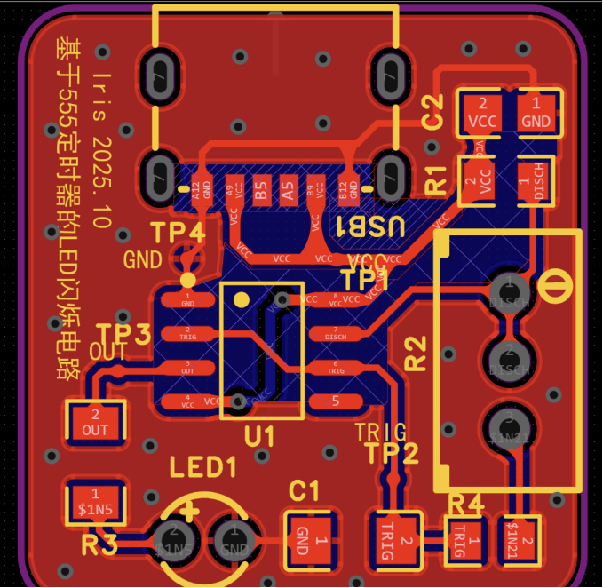
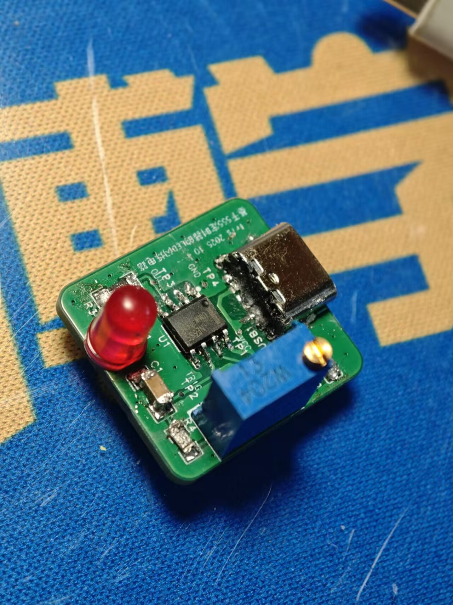

# 基于555定时器的LED闪烁电路

嘉立创工程在线链接： https://oshwhub.com/liyuelin06/ji-yu-555-ding-shi-qi-de-led-shan-shuo-dian-lu-4
## 原理

好文，通俗易懂：手把手教你555定时器闪光灯电路：元器件清单+工作原理详解 - 百芯 EMA的文章 - 知乎
https://zhuanlan.zhihu.com/p/601864371

大概就是，555计时器外围电路上，改变R1,R2,C1的值就能改3引脚输出的PWM频率从而可以控制LED亮灭

稍微具体一点就是：
- 连接2，6引脚，NE555处于非稳态模式，变成振荡器，从3引脚输出方波
-  2引脚检测电压低于电源电压的1/3时会打开输出，6引脚检测超过2/3时关闭输出，关闭输出时7引脚内部接地 
  
启动电路时，
-  C1放电，2引脚U=0，打开输出；
-  7引脚内部与GND断开，C1通过R1，R2变化
-  C1两端电压超过电源2/3，关闭输出，7引脚与GND连接，C1放电

电容充电“导通”时间：$t_1=0.693(R_1+R_2)C$
电容放电“关闭”时间：$t_2=0.693R_2C$
周期：$T=t_1+t_2$
频率：$f=\frac{1}{T}$
占空比：$\frac{R_1+R_2}{R_1+2R_2}$

另加了个电源滤波

看不懂原理只能东抄抄西抄抄啊——

## 设计

这次选了比较大的贴片和直插的LED主要是想方便焊接，不过其实都很小，可能操作难度也区别不大；然后是怕承载不了太大功率，就也往大的选了，确实没有自己仔细算到底至不至于搞个这么大的
TypeC接口想着仅供电就搞个简单的，不过好像也不够通用又要自己去买零件（）
想着固定频率没意思，就把R2改成了可变电阻，调着看看效果

中间禁止铺铜了，防止尖端放电
打了无数过孔连接地平面
搞了4个测试点应该方便一点排查电路哪里可能会有问题
电源线加粗了
VCC,GND并没有按细线指引连，怎么好连怎么搞，连起来就行了，没什么先后
GND其实可以不连直接铺铜，但是怕一些地成孤岛了就还是连连吧
8个引脚间的线要不绕路就打个过孔，alt+B就翻面

连线也要带脑子啊不用完全按指引连的——
发现快捷键确实好用，一个个点过孔翻面连线多慢啊——

## 焊接

comsen只能白嫖到0603 0805的电阻和电容，失算了，确实这么多乱七八糟的东西还是自己买吧，耽误了好几天啊

其实PCB下单也犹豫了很久，改了四次图，就是怕电路错了白折腾了——

typeC好难焊啊——感觉又烫废一个——

拆了焊第二个typeC还是感觉没焊好，但是不纠结了直接上电试试了结果真的能工作！！！可能是焊得太拉了R2竟然测出最高电阻130欧（（（

没事不要纠结啦调节很顺利！见视频！

<video controls src="555电路调试-1.mp4" title="Title"></video>