# 硬件学习笔记
看b站expert实验室视频，不错！
## 电子元器件
### 电阻
作用：限制电流、分压

额定功率：指电阻长期工作时，在规定温度下能承受的最大耗散功率，超过会烧毁。
单位为瓦特（W），常见规格有 1/8W、1/4W、1/2W、1W、2W 等，功率越大电阻体积通常越大。实际功耗应小于额定功率的 80% 。

### 电容
作用：
1. 滤波：通交流、隔直流，保留直流信号，过滤电路中的杂波信号。常见于电源电路，让输出电压更平稳，避免杂波影响设备正常工作。
2. 耦合：让交流信号在不同电路模块间传递（如音频、视频信号），不影响各模块的直流工作点
3. 隔直：阻止直流电压通过，避免前后级电路的直流相互干扰，保证电路正常偏置
4. 旁路：为高频信号提供 “捷径”，保护核心元件。并联在芯片电源引脚旁，滤除电源线上的高频噪声，稳定芯片工作电压。
5. 储能:瞬间储存电能，在电压波动或断电瞬间释放，避免设备因供电不稳停机。常见于闪光灯、电容触摸屏等设备，提供瞬时大电流。
6. 谐振与调谐：与电感配合形成谐振电路，筛选特定频率信号。
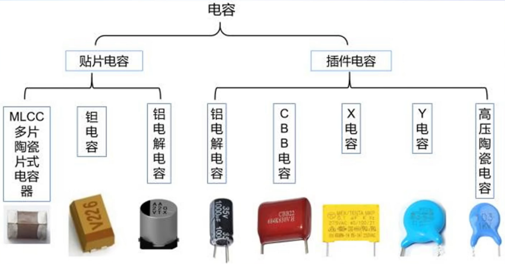
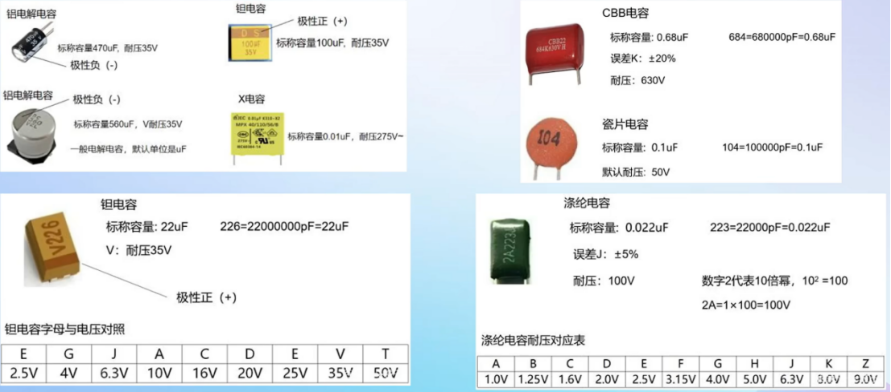
### 电感
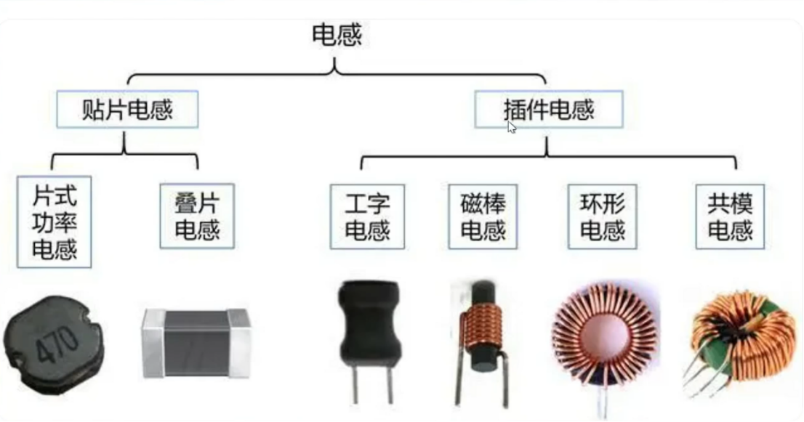
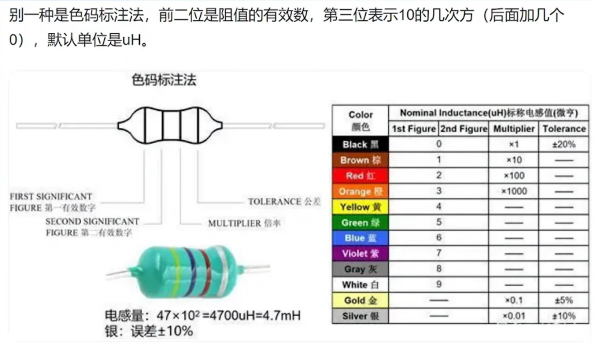
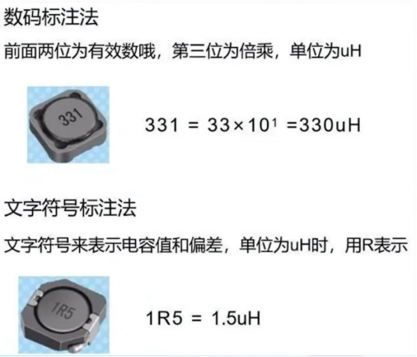
### 二极管
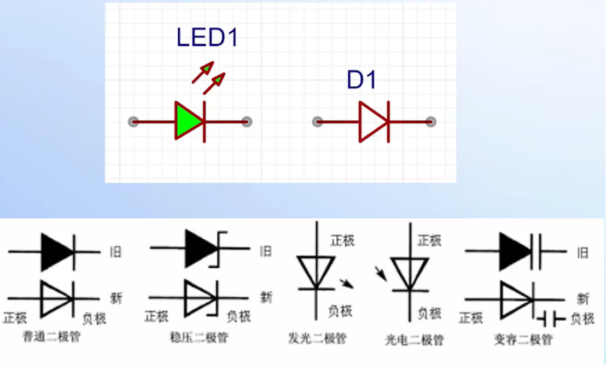
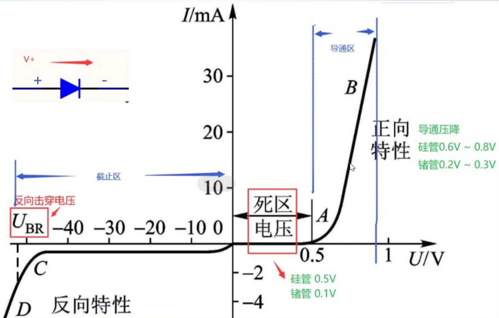
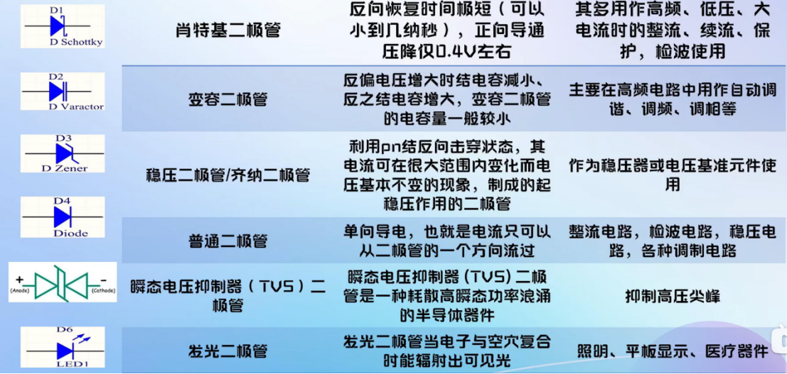
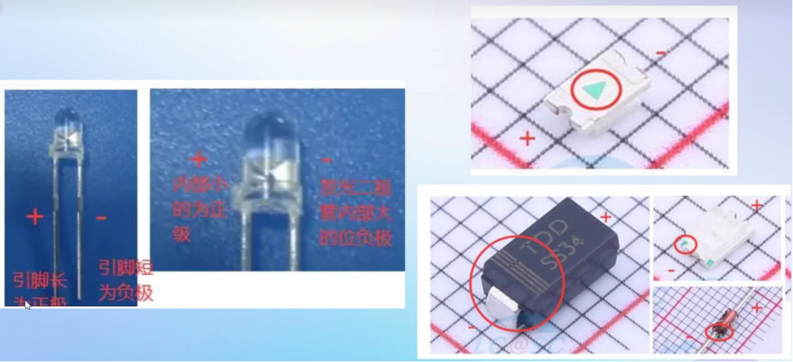
### 三极管
电流控制电流
作用：低频信号放大、功率开关、振荡电路
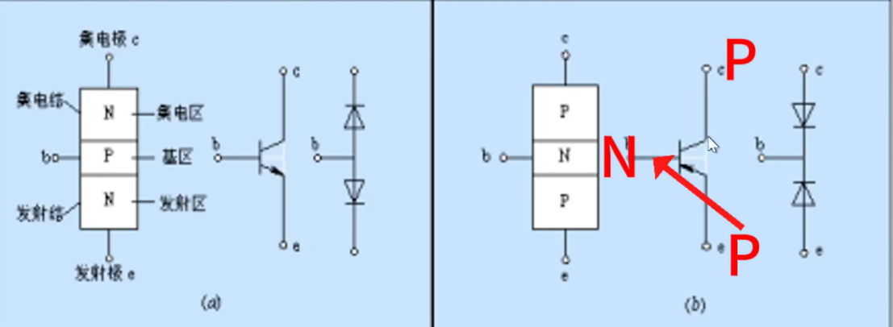
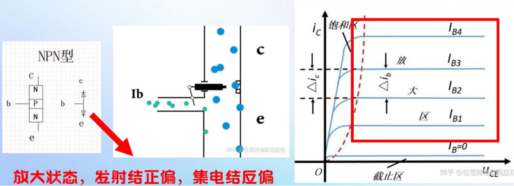
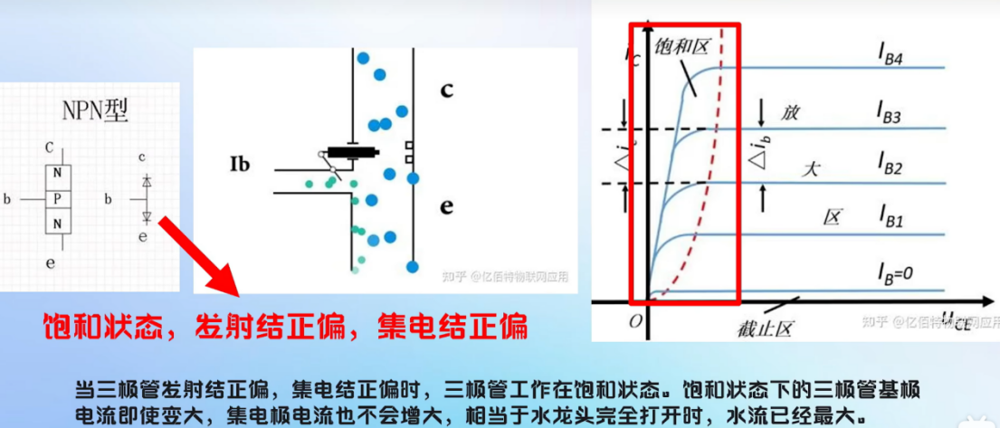
### 场效应管
电压控制电压
作用：高频放大，高速开关，功率控制
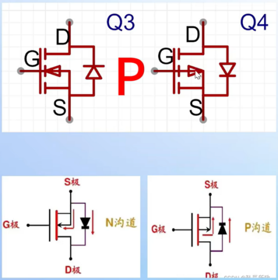
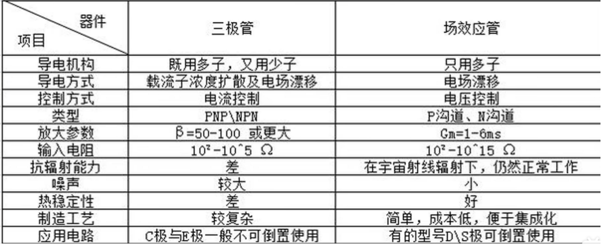
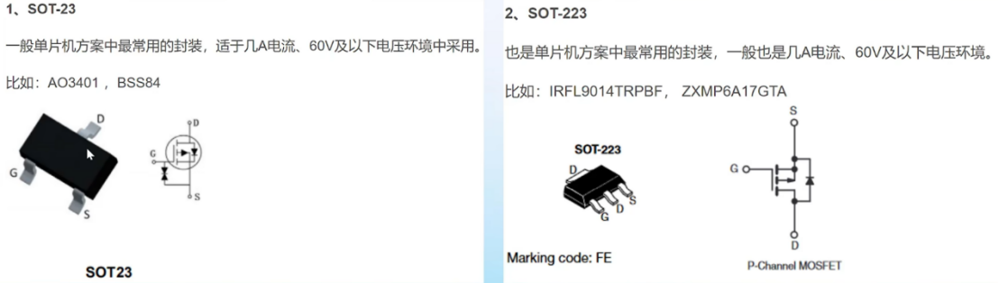
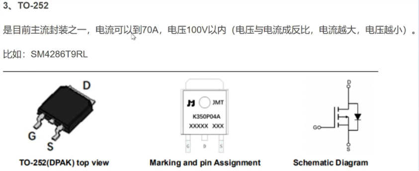
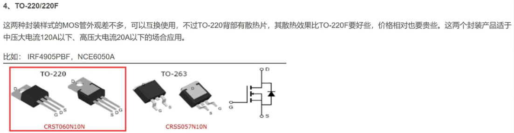
## PCB板
### 查手册
立创商城或半导小芯(https://www.semiee.com/)
[嘉立创EDA使用](https://prodocs.lceda.cn/)
[嘉立创下单页面](https://www.jlc.com/portal/vtechnology.html)
手册：
1. 特性（更详细的在说明里）
2. 引脚功能配置
3. 规格（电压电流温度）
4. ESD（静电防护）（了解）
5. 建议工作条件（电压温度）
6. 电气特性（电源电压，使能，振荡器频率，电流，热关断）（关注）
7. 详细说明里的功能方框图，和文字找英文模块对应
8. 应用和实现（参考示例电路）（重点）
9. PCB布局（如果有说明有特殊要求）
10. 封装对着机械图画
### 选型
555定时器：NE555
直插DIP-8  NE555P塑料 NE555N金属
贴片SOIC-8  SOP-8（更高密度）

(copy)常用元器件封装对照表

| 元器件类型 | 常用封装 | 说明 |
|-----------|---------|------|
| 电阻/电容 | 0805、0603、0402 | 数字表示尺寸（英制） |
| 电解电容 | RB2/5、RB5/10 | 直径/间距（mm） |
| LED | 0805、0603、5mm 插件 | 贴片或插件 |
| 二极管 | SOD-123、DO-214AC（SMA） | 贴片封装 |
| 三极管 | SOT-23、SOT-23-3 | 小信号三极管 |
| MOSFET | SOT-23、TO-252（DPAK） | 根据功率选择 |
| IC 芯片 | SOP、SSOP、QFP、QFN | 根据芯片型号 |
| 接插件 | 2.54mm 排针排母 | 标准间距 |
### 原理图
绿线：连接线
红点：结点
网络标签：电气连接点，相同标签表示电气连接在一起
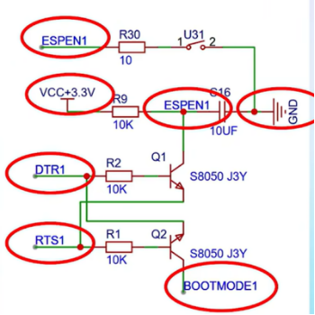
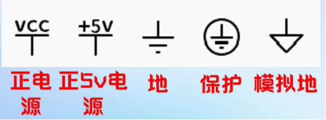
支路，回路，网孔（不可再分的回路）

集总参数元件（质点）（尺寸小于波长，高频时不能这样等效了）、分布参数元件
下面适用于集总参数电路：
基尔霍夫电流定律（KCL）：结点 流入=流出
					推广：电路中包围多个结点的任一闭合面 流入=流出
基尔霍夫电压定律（KVL）：回路 所有支路电压代数和=0 或升=降

注释：
标注元件功能：NC(no connect默认不进行连接),NF(no fix默认不安装),0R(0R电阻，可以进行短路)

画好原理图：
1. 分模块（电源、单片机、按键、显示屏、驱动……）
分图页（一个功能的放一页）
复杂的要放电源树、系统框图
2. 标注重要参数
3. 标注元件特殊/重要功能
4. 标注注意事项
5. 合理的网络标签
6. 标LOGO/版本号

USB串口转换模块：
电脑与单片机连接要 USB-to-UART协议转换，电脑USB信号（主从式高速复杂协议），单片机UART（TTL）信号（简单异步协议，TXD（发送），RXD（接收），GND三根线），主流用CH340芯片

快充诱骗芯片：
模拟特定快充协议的握手信号，输出更高电压或电流，快速充电、稳定供电

DCDC3.3V电路：
将不稳定直流电压（5,12,24V等）转为稳定3.3V直流电压给单片机、传感器、FPGA等对电源敏感的芯片供电

LDO5V电路：
Low Dropout Regulator（低压差（5.2V工作->5V）线性稳压器）进一步降低波纹和噪声

开关电源：

按键电路并联电容消除抖动，也可以软件消抖
### 画PCB
PCB(printed circuit board) 
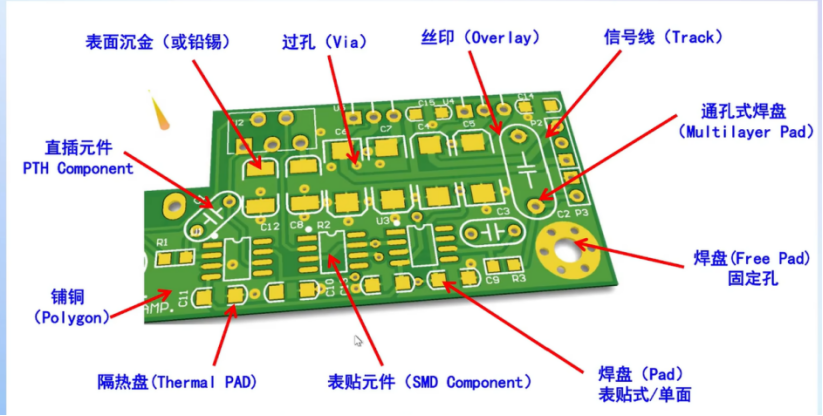
布完信号线后：铺铜：连GND网络、电源网络

十字连接防焊接时散热焊不上去
填充散热
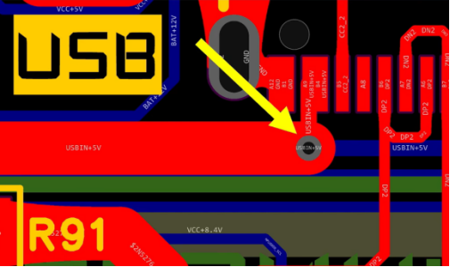
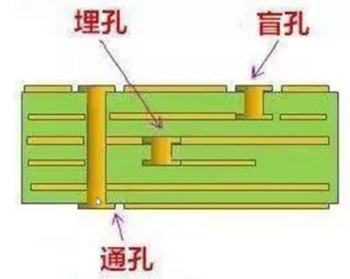
过孔：上图连顶层红信号线和底层蓝信号线；器件固定和定位
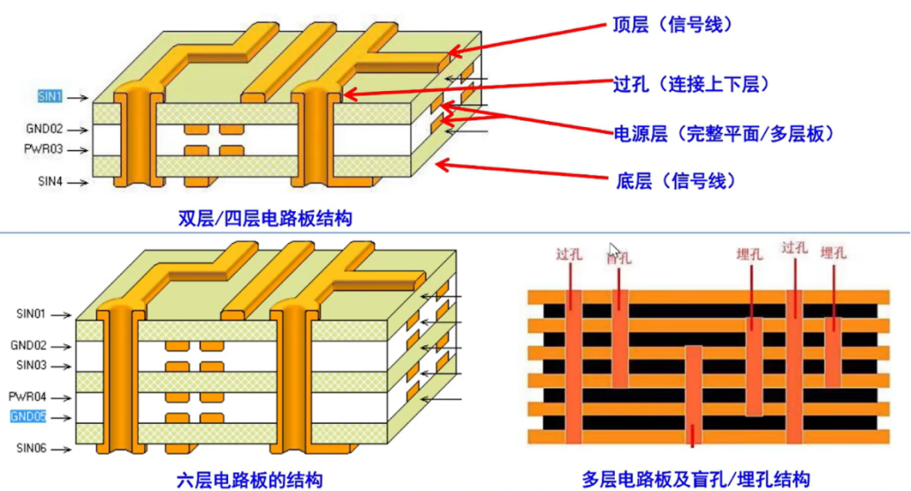
#### 图层介绍
三大类图层：导电层、掩膜层、绘图辅助层
信号层（顶层红底层蓝）
丝印层
阻焊层（略比焊盘大一圈，防焊料进铜线流到不焊接的地方）
锡膏层
多层（每层都有的，如过孔、直插焊盘）
板框层：标板框尺寸
机械层：装配的注释，不会印出来
3D外壳层
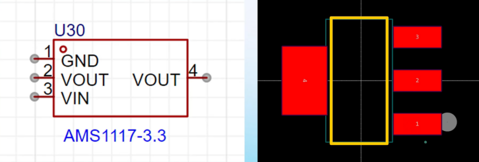
上图左边是原理图，右边是画PCB的封装，小圆点对应1号引脚（左图左上、右图右下），黄色丝印表示元件大小
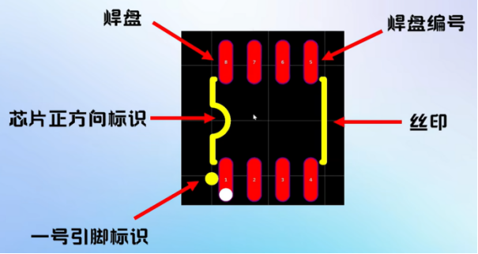
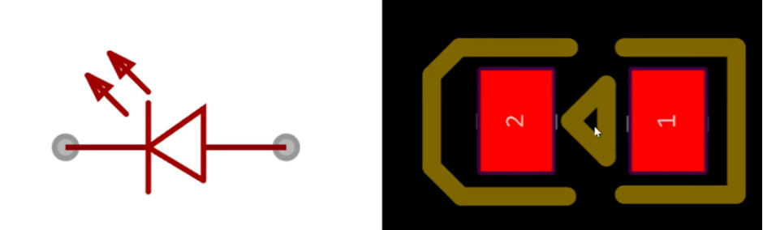
上图1号对应正极，看三角形
#### PCB设计流程
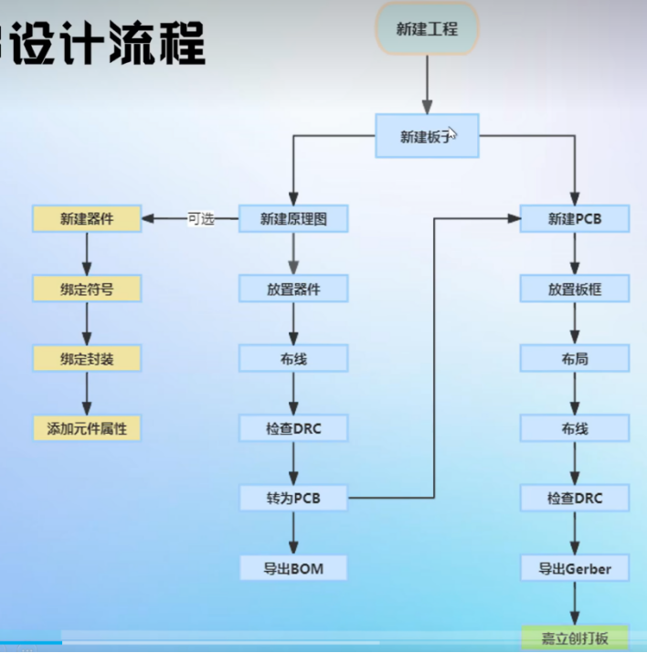
板框100mm*100mm以内不要钱，画圆角（点击右键）
过孔外直径4mm，内直径3mm
检查DRC（Design Rule Check）
BOM表：元器件清单

交叉布局：选中原理图元件按Shift+X跳转到PCB对应位置
布局传递：按原理图摆放方式摆PCB，选中要的元件按Ctrl+Shift+X
按空格旋转
SOP（Small Outline Package，最小外形封装）SO8：8引脚
铺铜连GND,可以先把地线连一遍怕其他线把GND包住了铺不进去
#### 封装
多放一点，引脚长圆形焊盘直径max 0.48就做0.6，引脚长typ 1.04就做1.9，多个用线性阵列

摆放注意：
1. 有插口的放边缘，芯片放中间，传感器放边上
2. 用组合功能摆整齐
#### 布线
Shift+w改线宽
Alt+B底层Alt+t顶层

1. 顶层优先
2. 电源线加粗 铜厚10z(盎司)10mil线宽0.65A，49mil2.3A
3. 走线135度，不要走直角或锐角（走线阻抗不连续，影响信号传输）
4. 电源先滤波再给后级
5. 去耦电容要贴近芯片引脚并就近接地，最小的最近
6. 晶振两路差分线尽量等距等长
7. 高频信号线要短，做好与其他信号的屏蔽隔离（3W原则:距离大于3倍线宽。相邻层信号线正交方向摆。晶振区域禁止铺铜（多层），外围打一圈接地通孔形成法拉第笼）
8. 布线远离安装孔和电路板边缘
9. 加泪滴
10. 横平竖直，不要大斜线
11. 接地多打过孔，前后两面缝起来

顺序：密度高的优先，关键元器件优先，关键信号线优先
